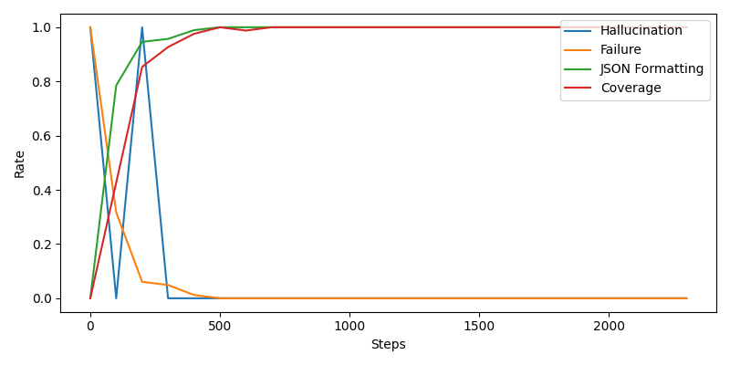
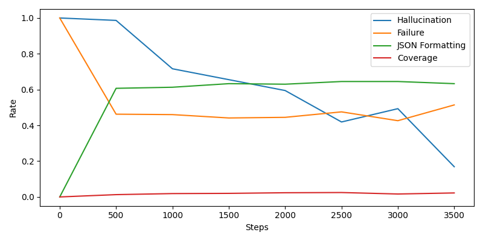
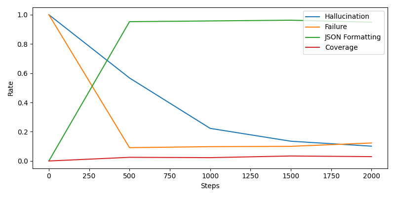
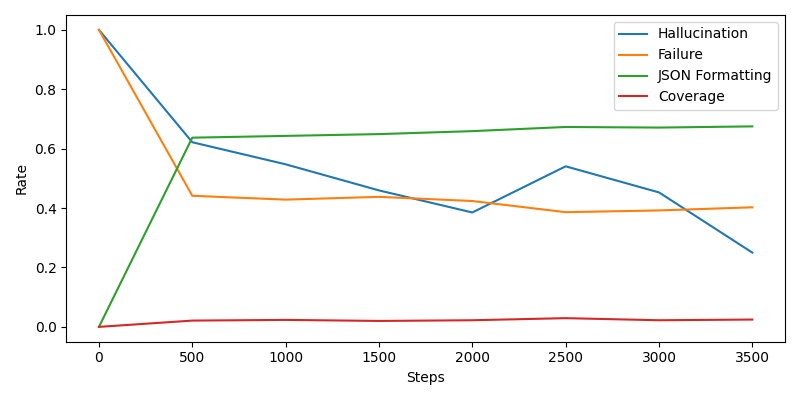
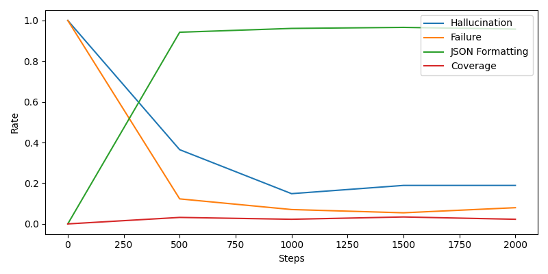

# Failure-aware GPT-2: When should a model answer, and when should it refuse?

> The model learned **how to answer** before it learned **what the answer is**.

---

## TL;DR

I trained GPT-2 (small and medium) to produce structured answers and explicitly refuse when a question is unanswerable.

- Learns JSON formatting and refusal behavior quickly  
- Fails to learn correct answers (~3–4% coverage)  
- Scaling improves stability, not correctness  
- Removing dataset noise helps behavior, not reasoning  
- Chain-of-thought reduces performance (coverage → 0%)  

This started out as a from-the-scratch implementation of GPT2 architecture, but my curiosity led me to perform this experiment :P 

---

## Setup

- Models: GPT-2 small, GPT-2 medium  
- Datasets: GSM8K, Dolly15K  
- Output format:

```json
{"status":"ANSWERABLE","answer":"42"}
```

---

## Metrics

- Hallucination Rate  
- Failure Rate  
- Coverage  
- JSON Formatting Rate  

### Hallucination Rate

Fraction of *unanswerable* examples where the model does not correctly refuse.

---

### Failure Rate

Fraction of *answerable* examples where the model fails to provide an answer.

---

### JSON Formatting Rate

Fraction of outputs that are valid JSON.

---

### Coverage (Strict Accuracy)

Fraction of *answerable* examples where the model produces the correct answer.


A prediction is correct if:
- output is valid JSON  
- status = `"ANSWERABLE"`  
- normalized answer matches target exactly  

---

## Experiments

| Experiment | Model | Dataset | Observation |
|----------|------|--------|------------|
| Overfit | Small | Tiny | Memorizes perfectly |
| Baseline | Small | Mixed | Learns structure only |
| GSM-only | Small | GSM8K | Stable, still wrong |
| Scaling | Medium | Mixed | Better behavior |
| Best-case | Medium | GSM8K | Still low accuracy |

---

## Results

| Model | Dataset | Coverage | Hallucination | Failure | JSON |
|------|--------|----------|---------------|---------|------|
| Small | Mixed | 0.026 | 0.299 | 0.416 | 0.65 |
| Small | GSM8K | 0.041 | 0.123 | 0.058 | 0.97 |
| Medium | Mixed | 0.033 | 0.252 | 0.390 | 0.67 |
| Medium | GSM8K | 0.036 | 0.139 | 0.044 | 0.97 |

---

## Key Findings

- Structure learned before correctness  
- Dataset cleaning helps stability, not reasoning  
- Scaling doesn't solve reasoning  
- Chain-of-thought hurts  

---

## Why it failed?

- CoT supervision: GSM8K was designed for chain-of-thought. Answer-only supervision removes the reasoning path the model needs to learn from
- Capacity ceiling: 117M/345M parameters is below the threshold where arithmetic reasoning emergently appears
- Dataset conflict: at this scale, math and instruction-following objectives compete rather than complement

---

## Plots

### Overfitting behavior


### Mixed dataset training (small)


### GSM8K-only (small)


### Mixed dataset (medium)


### GSM8K-only (medium)


---

## Example Failures

### Experiment 1 : Overfit: The model breaks under memorization

On the overfit test, the model hadn't generalized anything. Two things stand out:

**Status field corruption:**
```json
Target: {"status": "UNANSWERABLE", "answer": "n/a"}
Output: {"status": "ANSANSWERABLE", "answer": "n/a"}
```
It output `"ANSANSWERABLE"` : a token-level corruption of the status field. The model is pattern-matching character sequences, not understanding the field.

**Long-form output collapse:**
```json
Target: {"status": "ANSWERABLE", "answer": "Butterfly is considered to be the hardest of all swimming strokes..."}
Output: {"status": "ANSWERABLE", "answer": "Swlerfly Creek the the be the hardest swimming all the strokes... and and and and stomach..."}
```
JSON structure holds. The content collapses completely. This is what the model looks like before it learns anything real : it knows the shell, not the content.

---

### Experiment 2 & 3 : GPT-2 Small: Structure works, numbers don't

After real training, the status field corruption is gone. JSON is valid. But answers are consistently off:

```json
Target: {"status": "ANSWERABLE", "answer": "70"}
Output: {"status": "ANSWERABLE", "answer": "90"}   // Exp 2 - Mixed

Target: {"status": "ANSWERABLE", "answer": "70"}
Output: {"status": "ANSWERABLE", "answer": "20"}   // Exp 3 - GSM8K only
```

The model isn't guessing randomly. It's guessing in the right range : two-digit numbers for two-digit targets, four-digit numbers for four-digit targets. It has learned the shape of the answer, not the answer.

Text answers degrade differently:
```json
Target: {"status": "ANSWERABLE", "answer": "Southwestern and Northwestern Iranian language"}
Output: {"status": "ANSWERABLE", "answer": "Perswestern Iranian Northwestern Iranian languages"}
```
It blends tokens from the target rather than computing them. Numbers have no such shortcut, so they just end up wrong.

---

### Experiment 4 & 5 : GPT-2 Medium: More stable, equally wrong

Scaling to medium gives cleaner outputs but doesn't fix correctness:

```json
// Medium, Mixed dataset
Target: {"status": "ANSWERABLE", "answer": "93"}
Output: {"status": "ANSWERABLE", "answer": "83"}

// Medium, GSM8K only
Target: {"status": "ANSWERABLE", "answer": "93"}
Output: {"status": "ANSWERABLE", "answer": "78"}
```

The gap between target and output is tighter in some cases : but that's not consistent. Coverage stays at ~3-4% regardless. Medium doesn't reason better, it just behaves more cleanly.

---

### The pattern across all experiments

The model never outputs the wrong *type* of answer after the overfit stage : it doesn't give a number when a word is expected, or vice versa. It learned what kind of answer to give. It just can't compute the right one.
---

## How to run

```bash
python gpt_download.py --size 124M
python gpt_download.py --size 355M

python -m instruction_fine_tuning.train --config configs/gpt2_small.yml
```

---

## Takeaway

- The model didn't fail randomly. It failed in a very specific, legible way.

- It optimized for what was easy, the JSON formatting and refusal. It got stuck on what was hard, correct reasoning. That's not a bug, that's what loss minimization does. The objective didn't distinguish between "output the right structure" and "output the right answer", so the model solved the easier one and called it a day.

- The interesting result isn't that coverage is 4%. It's that JSON formatting hit 97% in the same run. The model was learning. Just not the thing that matters.

- If I were to continue this: bigger model, chain-of-thought supervision, and separate the abstention logic from the generation objective. The scaffolding here is sound : the base model is the bottleneck.
